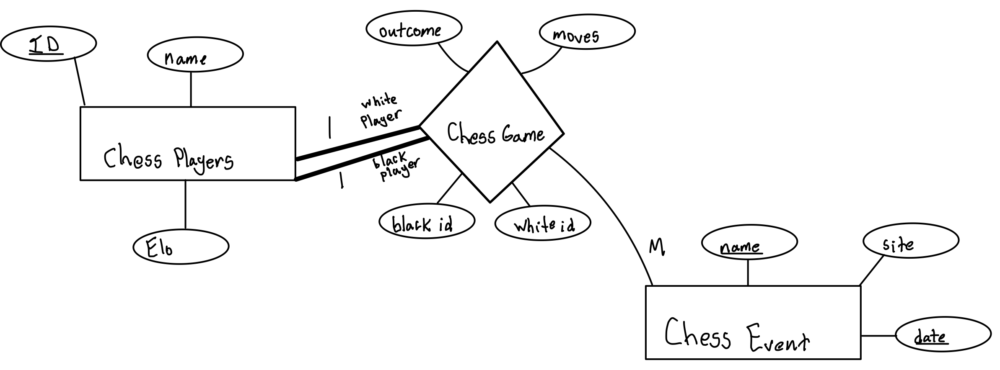

Players [__ID (integer)__, name (string), Elo (integer)]
Events [__name (string), date (date)__, site (string)]

CREATE TABLE Players(
	UNIQUE ID INT PRIMARY KEY,
	Name (string),
	Elo (integer),
)

CREATE TABLE Events(
	UNIQUE ID INT PRIMARY KEY,
	Name STRING SECONDARY KEY,
	Site (string)
	Game (blackID (integer), white ID (integer), moves (string), winnerID (integer))
)

